## AWS Gateway Load Balancer Centralized Architecture Validation

### Welcome

* This section walks you through steps to validate AWS Gateway Load Balancer Centralized Architecture.

### Validate access to resource on Internet from application running in Spoke1 VPC:

* From Appliance VPC stack Outputs tab, get the public IP address of the bastion host and private IP addresses of the two appliances:

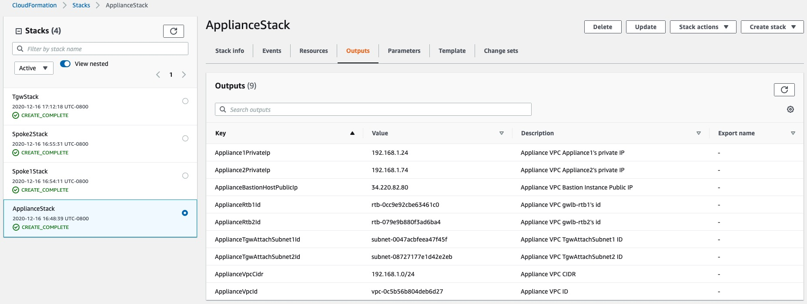

* Access appliances through bastion host:

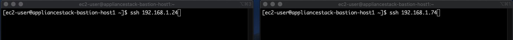

* From Spoke1 VPC stack Outputs tab, get the public IP address of the bastion host and private IP addresses of the application instance:

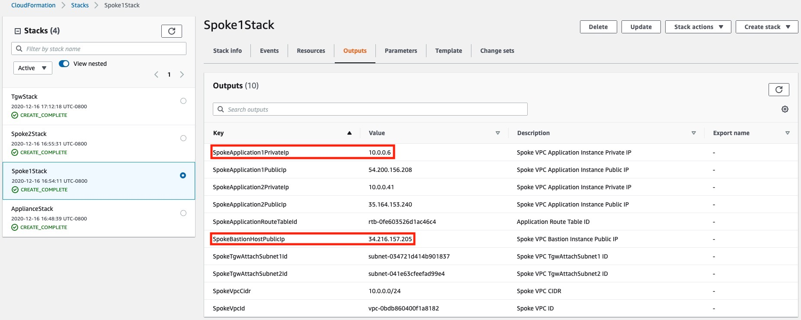

* Access application instance through bastion host:

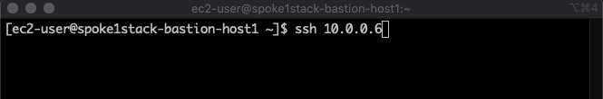

#### Ping:

* On both the appliances capture GENEVE traffic using tcpdump. 
* From application instance running in Spoke1 VPC, ping a resource on the internet.
* Ping is successful and ICMP traffic is sent to appliance using GENEVE.

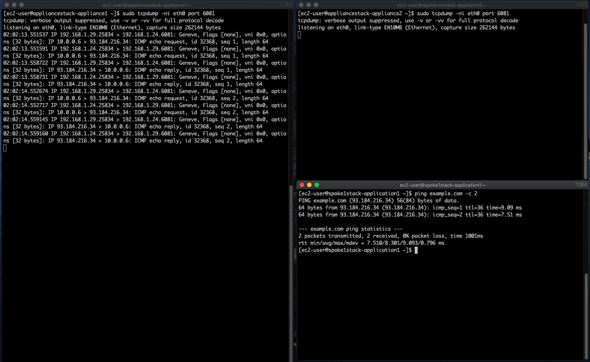

#### HTTP:

* On both the appliances capture GENEVE traffic using tcpdump. 
* From application instance running in Spoke1 VPC, access a resource on the Internet over HTTP.
* Example below uses a curl command to access simple webserver running on an EC2 instance. Command is successfull. HTTP traffic is sent to appliance using GENEVE.

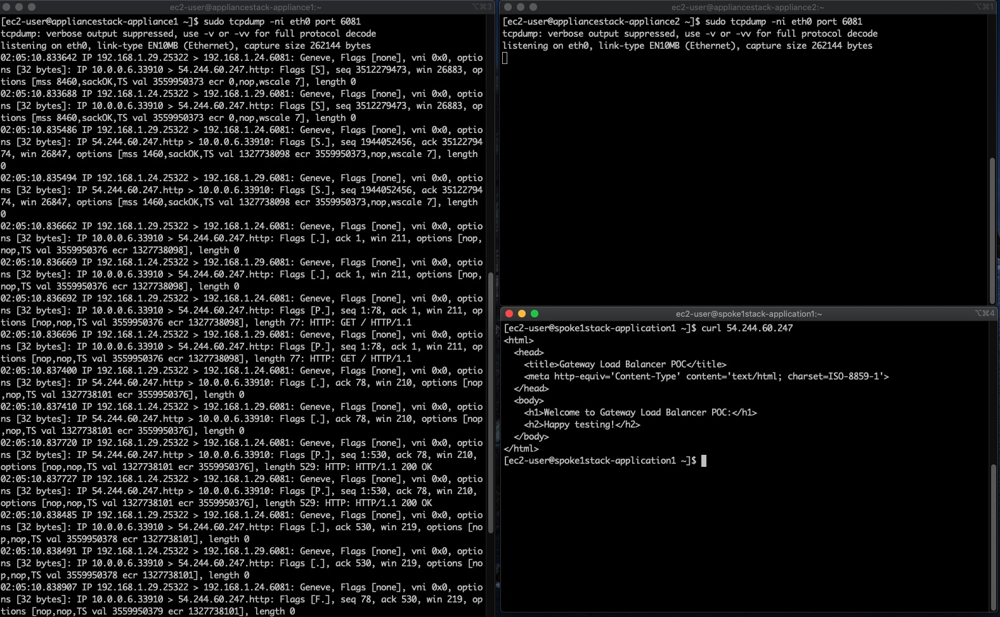

### Validate access to application running in Spoke2 VPC from application running in Spoke1 VPC (East-West/VPC-to-VPC):

* As explained in the [ Centralized inspection architecture with AWS Gateway Load Balancer and AWS Transit Gateway blog](https://aws.amazon.com/blogs/networking-and-content-delivery/centralized-inspection-architecture-with-aws-gateway-load-balancer-and-aws-transit-gateway/), to ensure flow symmetry, Transit Gateway appliance mode should be enabled on the Appliance VPC attachment. In example below, application instance in Availability Zone (AZ) A of Spoke1 VPC tries to SSH into application instances in AZ A and AZ C of Spoke2 VPC.

* From Spoke2 VPC stack Outputs tab, get the private IP addresses of the application instances:

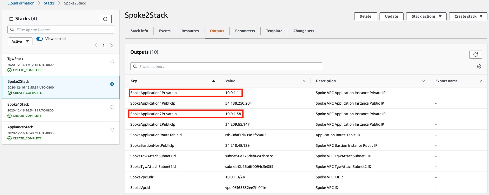

#### Transit Gateway appliance mode disabled:

* With Transit Gateway appliance mode disabled, application instance in AZ A of Spoke1 VPC is able to access application instance in AZ A of Spoke2 VPC over SSH. 

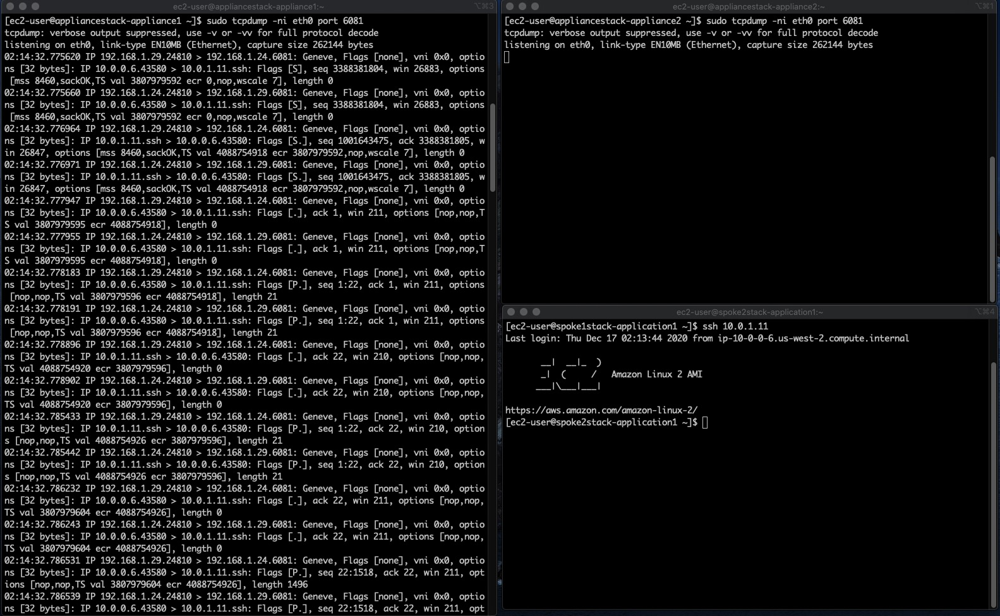

* Since application instance in AZ C of Spoke2 VPC is in a different AZ, it is not accessible.

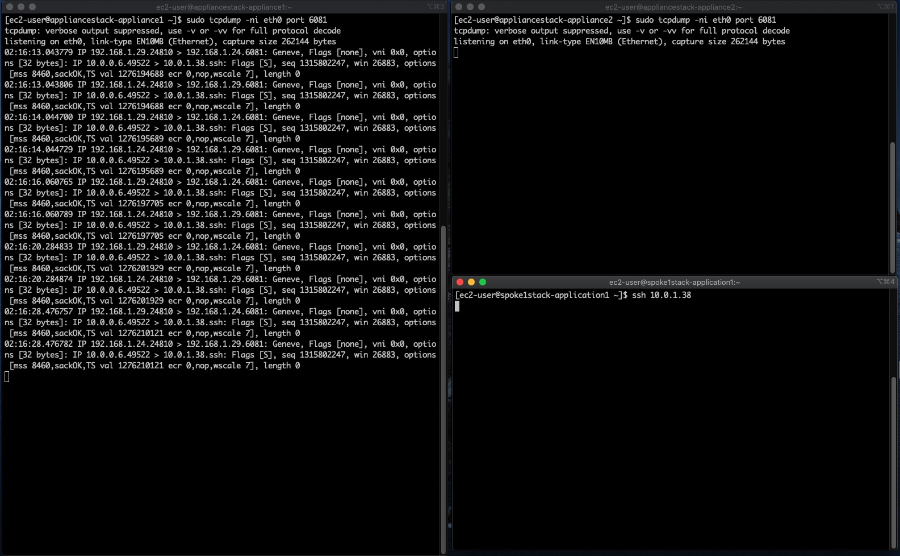

#### Transit Gateway appliance mode enabled:

* From Transit Gateway stack Outputs tab, get the Appliance VPC attahcment ID:

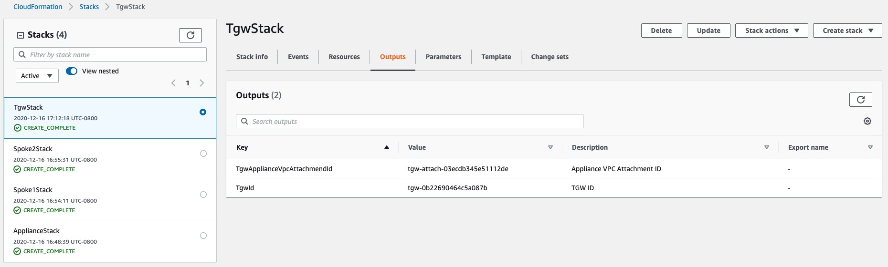

* Enable Tranist Gateway appliance mode for the Appliance VPC attachment:

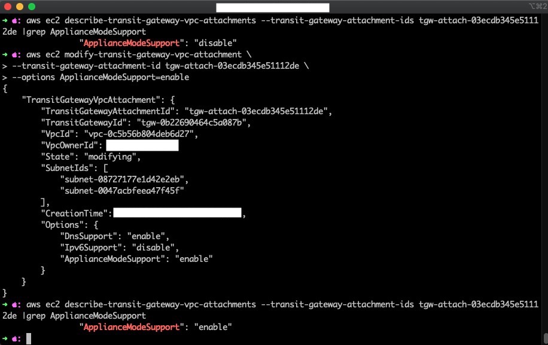

* With Transit Gateway appliance mode enabled, application instance in AZ A of Spoke1 VPC is able to access both the application instances in Spoke2 VPC over SSH.

* Application instance in AZ A of Spoke2 VPC:

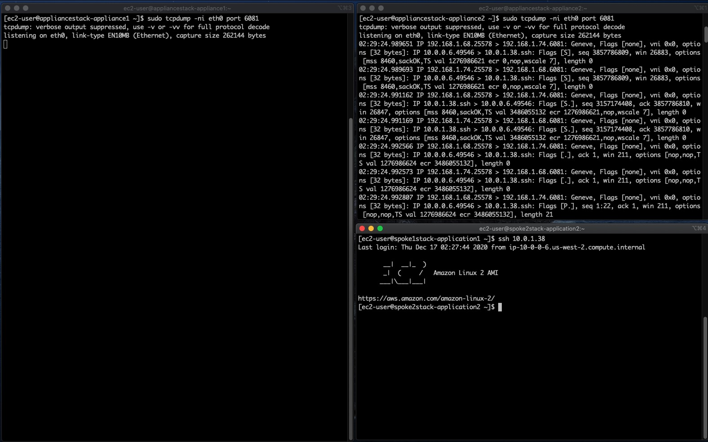

* Application instance in AZ C of Spoke2 VPC:

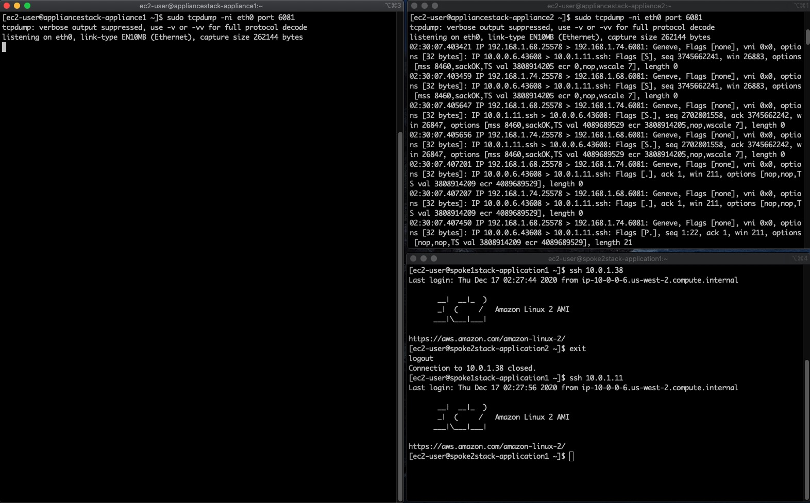