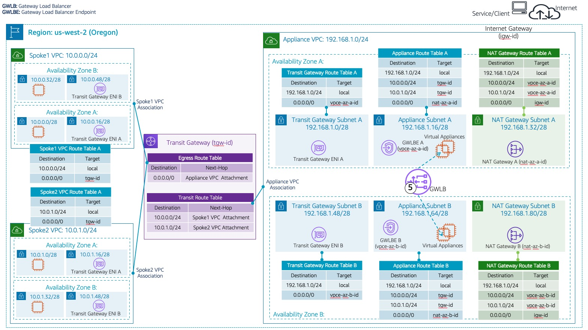

## AWS Gateway Load Balancer In Centralized Architecture

### Welcome

This section contains sample AWS CloudFormation templates that demonstrates how to create centralized inspection architecture using AWS Gateway Load Balancer (GWLB) AWS Gateway Load Balancer Endpoints (GWLBe), virtual appliances and AWS Transit Gateway (TGW) from templates that are written in YAML.

Here you will find sample AWS CloudFormation templates for centralized architecture described in the blog **[Centralized inspection architecture with AWS Gateway Load Balancer and AWS Transit Gateway](https://aws.amazon.com/blogs/networking-and-content-delivery/centralized-inspection-architecture-with-aws-gateway-load-balancer-and-aws-transit-gateway/)**

**Note:** For other architecture patterns, refer to [Centralized Architecture Patterns](centralized_architecture_patterns)


_Figure 1: GWLB Centralized Architecture_

* **Launch CloudFormation templates in following order:**
  1. Appliance VPC Template
  2. Spoke1 VPC Template
  3. Spoke2 VPC Template
  4. Transit Gateway Template. Transit Gateway Template is dependent on Appliance VPC, Spoke1 VPC and Spoke2 VPC templates. Template will fail if launched before successfuly deployments of above 3 templates.

### **Appliance VPC:**
* [GWLB Appliance VPC Sample](CentralizedArchitectureApplianceVpc2Az.yaml)

### **Spoke VPCs:**
* We use the same spoke VPC template for both Spoke1 VPC and Spoke2 VPC. When deploying the template for Spoke2 VPC, make sure you have changed the default values so that Spoke2 VPC has different VPC and related subnet network addresses.

* [GWLB Spoke1 VPC Sample](CentralizedArchitectureSpokeVpc2Az.yaml)
* [GWLB Spoke2 VPC Sample](CentralizedArchitectureSpokeVpc2Az.yaml)

### **Transit Gateway:**
* [GWLB Transit Gateway Sample](CentralizedArchitectureTgw.yaml)
  * Use appropriate values for the parameters. 
  * Use Appliance VPC and Spoke VPCs stack Outputs section to retrieve the values.
  * Template enables Transit Gateway appliance mode.

### Enable Transit Gateway Appliance Mode:

* To ensure flow symmetry, Transit Gateway appliance mode should be enabled on the Appliance VPC’s attachment. 

* [GWLB Transit Gateway Sample](CentralizedArchitectureTgw.yaml) enables appliance mode for the Appliance VPC attachment. 

* You can also enable/disable appliance mode using AWS CLI. Once Transit Gateway template has been successfully deployed, fetch the Appliance VPC Attachment ID from stack's Outputs tab and enable/disable applince mode using AWS CLI as shown below. Replace the parameter values inside '< >' with appropriate values.

```bash
aws ec2 modify-transit-gateway-vpc-attachment \
    --transit-gateway-attachment-id <tgw-attach-0253EXAMPLE>
    --options ApplianceModeSupport=enable
```

### 1-Click Deployment:

* Alternatively, you can deploy [gwlb centralized architecture stack](https://us-west-2.console.aws.amazon.com/cloudformation/home?region=us-west-2#/stacks/create/template?stackName=GwlbCentralizedDemo&templateURL=https://tech-content-us-west-2.s3-us-west-2.amazonaws.com/aws-gwlb-cloudformation-samples/centralized-architecture/nested-stack/CentralizedArchitecturePrimary.yaml) and it will provision the resources as described in _Figure 1: GWLB Centralized Architecture_. 
  * While the link above launches the stack in Oregon (us-west-2) region, you can change the region to your choice. Make sure GWLB is supported in the region you choose to deploy the stack in.

### Validation Steps:
* [GWLB Centralized Architecture Validation](CentralizedArchitectureValidation.md)
