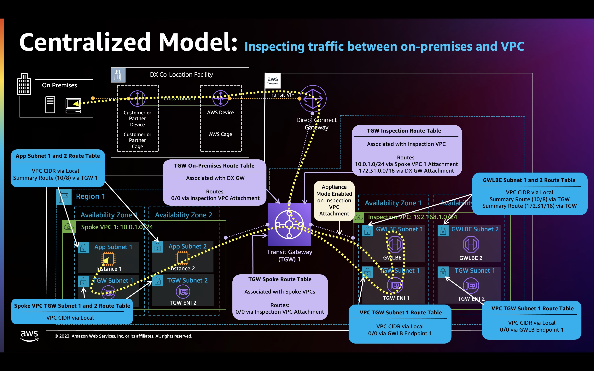

### Welcome
This section contains sample AWS CloudFormation templates for inspecting traffic between On Premises and Amazon VPC.

**Note:** It is end users responsibility to provision and configure AWS Direct Connect connection, transit virtual interface (VIF) and AWS Direct Connect gateway to enable communication between On Premises and Amazon VPC. Refer to following additional resources for more details:

* [What is AWS Direct Connect?](https://docs.aws.amazon.com/directconnect/latest/UserGuide/Welcome.html)
* [AWS Direct Connect + AWS Transit Gateway](https://docs.aws.amazon.com/whitepapers/latest/aws-vpc-connectivity-options/aws-direct-connect-aws-transit-gateway.html)
* [AWS Transit Gateway Associations](https://docs.aws.amazon.com/directconnect/latest/UserGuide/direct-connect-transit-gateways.html)

### Sample AWS CloudFormation templates

_Figure 1: GWLB Centralized Architecture_

* **Launch CloudFormation templates in following order:**
  1. Inspection VPC Template
  2. Spoke1 VPC Template
  3. Transit Gateway Template. Transit Gateway Template is dependent on Inspection VPC and Spoke1 VPC templates. Template will fail if launched before successful deployments of above 2 templates.

#### **Inspection VPC:**
* [GWLB Inspection VPC Sample](CentralizedArchitectureInspectionVpc2Az.yaml)

#### **Spoke VPCs:**

* [GWLB Spoke1 VPC Sample](CentralizedArchitectureSpokeVpc2Az.yaml)

#### **Transit Gateway:**
* [GWLB Transit Gateway Sample](CentralizedArchitectureTgw.yaml)
  * Use appropriate values for the parameters. 
  * Use Appliance VPC and Spoke VPCs stack Outputs section to retrieve the values.
  * Template enables Transit Gateway appliance mode.

