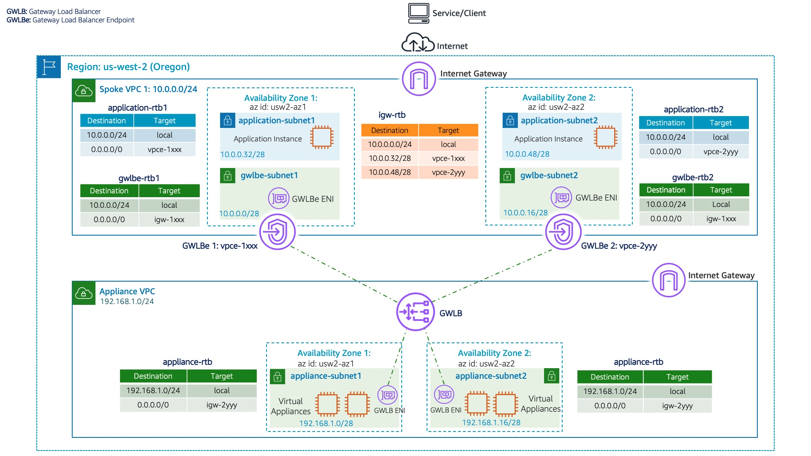

### AWS Gateway Load Balancer In Distributed Architecture

## Welcome

* For more details, refer to blog: **[Scaling network traffic inspection using AWS Gateway Load Balancer](https://aws.amazon.com/blogs/networking-and-content-delivery/scaling-network-traffic-inspection-using-aws-gateway-load-balancer/)**

* This section contains sample AWS Cloudformation templates that demonstrates how to create distributed architecture using AWS Gateway Load Balancer and Gateway Load Balancer Endpoints from templates that are written in YAML.

 * **Launch GWLB Appliance VPC Sample template before launching GWLB Spoke VPC Sample template.**
   * Appliance creates VPC Endpoint Service Name required for the Spoke VPC. Spoke VPC creates Gateway Load Balancer Endpoint using the VPC Endpoint Service created by Appliance VPC 

### **Appliance VPC:**
* [GWLB Appliance VPC Sample](DistributedArchitectureApplianceVpc2Az.yaml)

### **Spoke VPC:**
* [GWLB Spoke VPC Sample](DistributedArchitectureSpokeVpc2Az.yaml)
