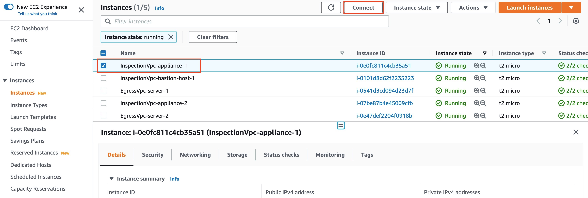
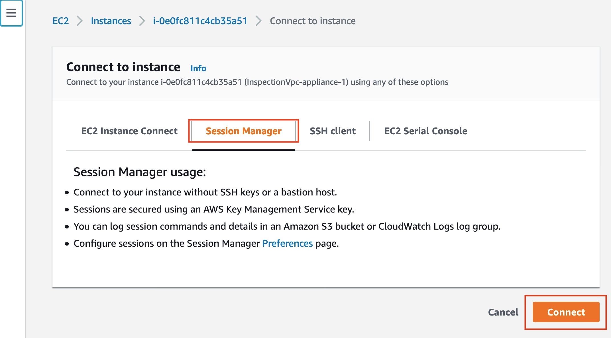
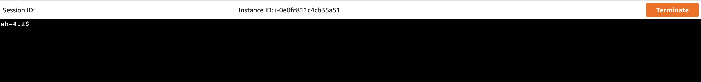
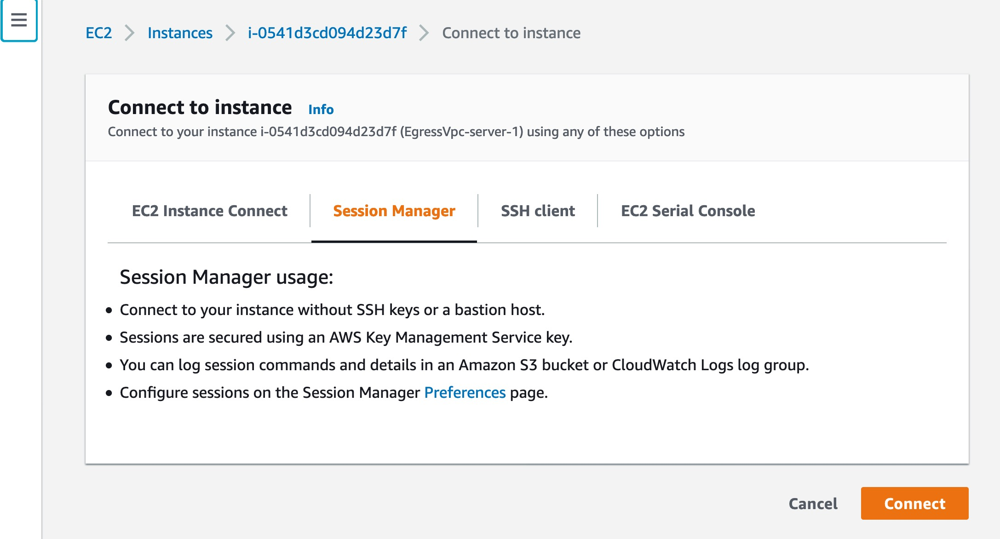
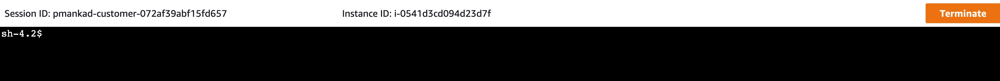
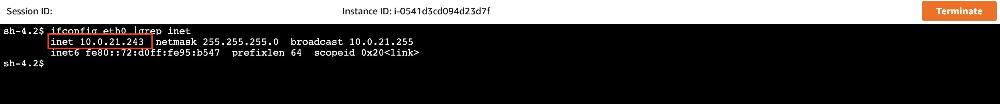
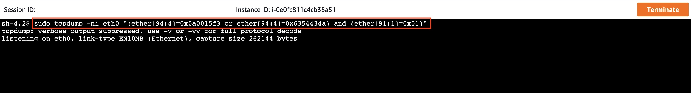
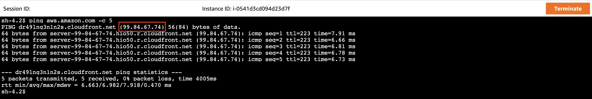

## AWS GWLB + VPC Routing Enhancement + NAT GW Validation:

### Welcome

* This section walks you through steps to validate traffic inspection between private resources and NAT gateway using VPC routing enhancemnts and GWLB endpoint.

### Testing:

1. Using Session Manager, connect to Appliance 1 running in Inspection VPC:


*Figure 1: Select appliance 1 and click on Connect*


*Figure 2: Select Session Manager and click on Connect*


*Figure 3: Appliance 1*


2. Using Session Manager, connection to Server 1 running in Egress VPC:


*Figure 4: Select server 1 and click on Connect*



*Figure 5: Select Session Manager and click on Connect*



*Figure 6: Server 1*


3. Verify the IP address for the server:


*Figure 7: Server 1 IP address*


4. Capture GENEVE traffic using tcpdump:
   
   The following tcpdump command filters traffic based inside packet source and destination IP and protocol.
   
   * 0x0a0015f3 = 10.0.21.243, IP address of server 1
   * 0x6354434a = 99.84.67.74, IP address for aws.amzazon.com
   * 0x01 = ICMP

```bash
sudo tcpdump -ni eth0 "(ether[94:4]=0x0a0015f3 or ether[94:4]=0x6354434a) and (ether[91:1]=0x01)"
```


*Figure 8: Capture GENEVE traffic on appliance 1*


5. From Server 1, access a resource on Internet:


*Figure 9: Access Internet resource from server 1*


6. Verify traffic being processed by Appliance 1:

   * In Figure 10 below, you can see server 1's IP address.
   * While veryifying traffic on inspection appliance, you notice 2 packets. This is because inspection appliance is set up in an [hairpin mode](../../aws-cli/gwlb/configure_iptables_al2.md). In this mode, it sends all the traffic that it receives from GWLB back to GWLB on same interface.


*Figure 10: Verify traffic is being processed by appliance 1*
