## AWS GWLB + VPC Routing Enhancement + NLB Validation:

### Welcome

* This section walks you through steps to validate ingress traffic inspection with NLB - using VPC routing enhancements and GWLB endpoint.

The NLB is configured as follows:

- NLB has `Preserve client IP addresses` `off`

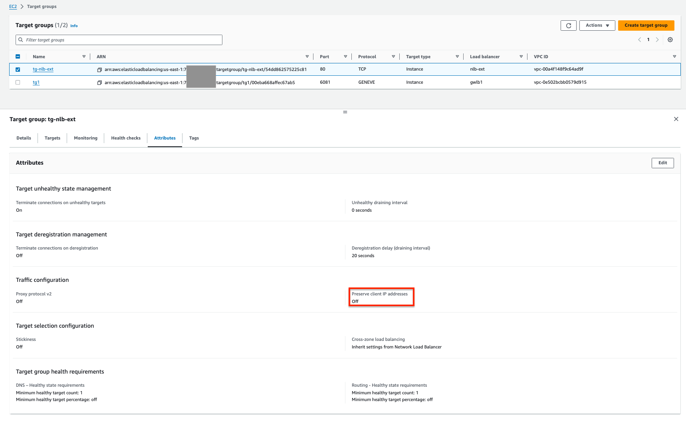

- NLB targets instances using their IDs

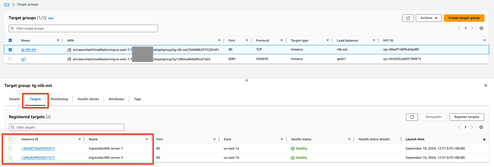

### Testing:

1. Using Session Manager, connect to Appliance 1 running in the Inspection VPC:

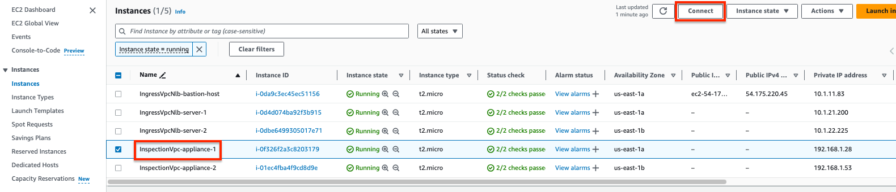

*Figure 1: Select appliance 1 and click on Connect*

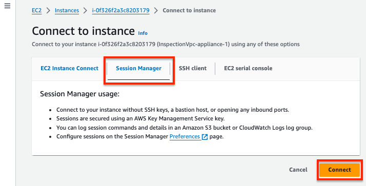

*Figure 2: Select Session Manager and click on Connect*


*Figure 3: Appliance 1*

2. Using Session Manager, connection to Server 1 and Server 2 running in Ingress VPC:

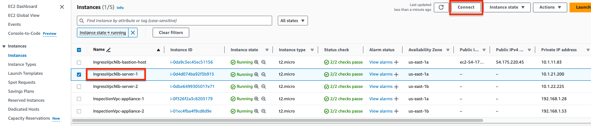

*Figure 7: Select server 1 and click on Connect*

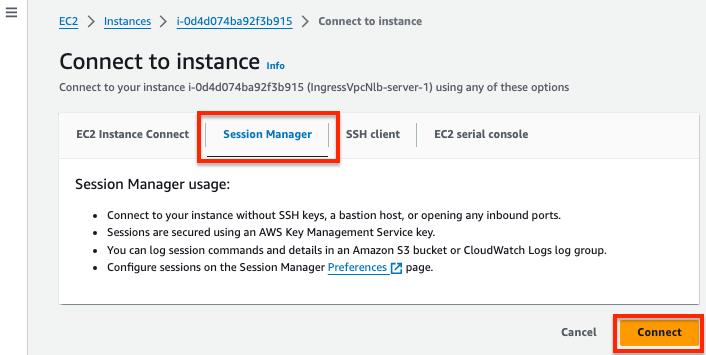

*Figure 8: Select Session Manager and click on Connect*

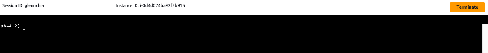

*Figure 9: Server 1*

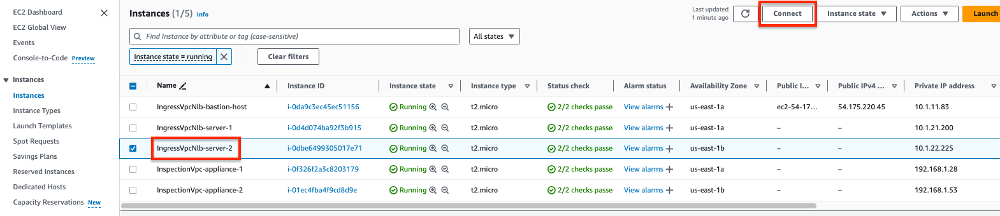

*Figure 10: Select server 2 and click on Connect*


*Figure 11: Select Session Manager and click on Connect*

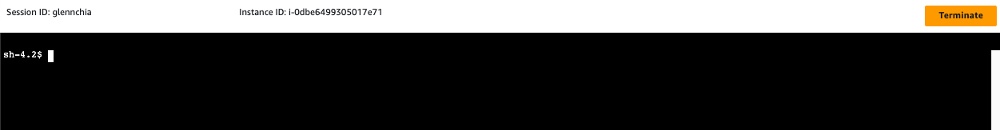

*Figure 12: Server 2*

3. Verify the IP address for the servers:

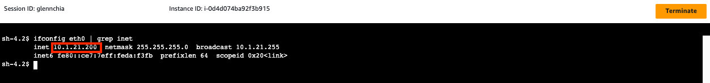

*Figure 13: Server 1 IP address*

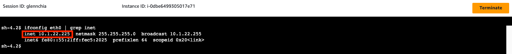

*Figure 14: Server 2 IP address*

4. Capture GENEVE traffic using tcpdump.

   The following tcpdump command filters traffic based inside packet source and destination IP and protocol.

   * 0x0a0115c8 = 10.1.21.200, server 1's IP address
   * 0x0a0116e1 = 10.1.22.225, server 2's IP address
   * 0x0a010bfc = 10.1.11.252, NLB's AZ1 private IP address

```bash
sudo tcpdump -ni eth0 "(ether[94:4]=0x0a010bfc and ether[98:4]=0x0a0115c8) or (ether[94:4]=0x0a010bfc and ether[98:4]=0x0a0116e1) or (ether[94:4]=0x0a0115c8 and ether[98:4]=0x0a010bfc) or (ether[94:4]=0x0a0116e1 and ether[98:4]=0x0a010bfc) and (ether[91:1]=0x06)"
```

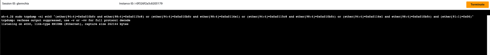

*Figure 15: Capture GENEVE traffic on appliance 1*

5. Access NLB's FQDN on HTTP:

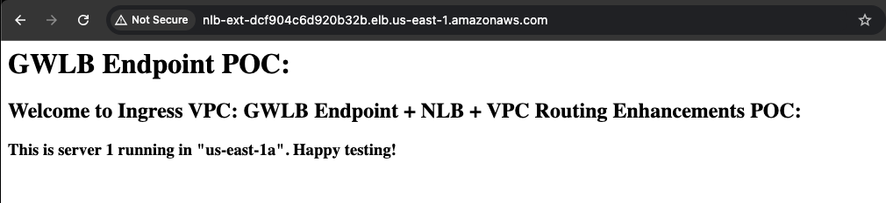
*Figure 17: Access NLB*

4. Verify traffic being processed by respective appliances

   * While verifying traffic on inspection appliance, you notice 2 packets. This is because inspection appliance is set up in an [hairpin mode](../../aws-cli/gwlb/configure_iptables_al2.md). In this mode, it sends all the traffic that it receives from GWLB back to GWLB on same interface.

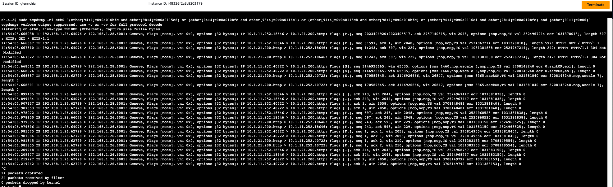
*Figure 18: Verifying Traffic on Appliance 1*
